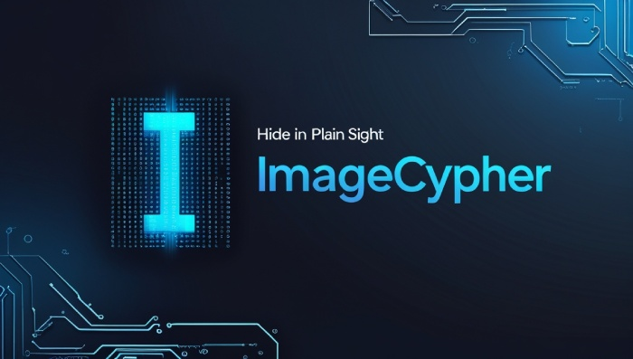

# ImageCypher - Hide in Plain Sight

<p>
  
</p>

ImageCypher est une application de stéganographie sécurisée qui permet de cacher des messages secrets dans des images. L'application combine la technique LSB (Least Significant Bit) avec un chiffrement AES robuste pour garantir la confidentialité des messages.

## Caractéristiques

- ✨ Stéganographie LSB pour cacher des messages dans les images
- 🔐 Chiffrement AES des messages avant l'encodage
- 🛡️ Protection contre les attaques courantes
- 📝 Support des messages jusqu'à 1 MB
- 🖼️ Compatibilité avec les formats PNG, JPG, JPEG et BMP
- 🔑 Dérivation sécurisée des clés avec PBKDF2
- ⚠️ Validation robuste des entrées et gestion des erreurs

## Prérequis

- Python 3.6 ou supérieur
- pip (gestionnaire de paquets Python)

## Installation

1. Clonez le dépôt :
```bash
git clone https://github.com/votre-username/ImageCypher.git
cd ImageCypher
```

2. Installez les dépendances :
```bash
pip install -r requirements.txt
```

## Utilisation

### Lancer l'application

```bash
python imagecypher.py
```

### Encoder un message

1. Sélectionnez l'option 1 (Encoder)
2. Entrez le chemin de l'image source (formats supportés : PNG, JPG, JPEG, BMP)
3. Saisissez votre message secret (max 1 MB)
4. Spécifiez le chemin de sauvegarde pour l'image encodée
5. Entrez un mot de passe fort pour le chiffrement

### Décoder un message

1. Sélectionnez l'option 2 (Décoder)
2. Entrez le chemin de l'image contenant le message
3. Fournissez le mot de passe de déchiffrement
4. Le message secret sera affiché à l'écran

## Sécurité

ImageCypher intègre plusieurs couches de sécurité :

- **Chiffrement** : Utilisation du chiffrement AES via Fernet
- **Clés** : Dérivation sécurisée des clés avec PBKDF2-HMAC-SHA256
- **Validation** : Vérification stricte des entrées et des chemins de fichiers
- **Protection** : Nettoyage automatique des données sensibles
- **Formats** : Liste blanche des formats d'images autorisés

## Structure du projet
```
ImageCypher/
├── README.md           # Documentation du projet
├── requirements.txt    # Dépendances Python
├── imagecypher.py     # Code source principal```

## Dépendances

- Pillow (11.0.0) : Manipulation d'images
- cryptography (41.0.7) : Chiffrement et sécurité

## Bonnes pratiques

1. **Mots de passe** :
   - Utilisez des mots de passe forts
   - Ne réutilisez pas les mots de passe
   - Ne partagez jamais vos mots de passe

2. **Images** :
   - Utilisez de préférence des images PNG
   - Évitez les très petites images
   - Vérifiez la taille nécessaire pour votre message

3. **Sécurité** :
   - Gardez vos images encodées en lieu sûr
   - Supprimez les fichiers temporaires
   - Utilisez des chemins de fichiers sécurisés

## Limitations

- La taille maximale du message est limitée à 1 MB
- Seuls les formats PNG, JPG, JPEG et BMP sont supportés
- La modification de l'image encodée peut corrompre le message

## Contribution

Les contributions sont les bienvenues ! Pour contribuer :

1. Forkez le projet
2. Créez une branche pour votre fonctionnalité
3. Committez vos changements
4. Poussez vers la branche
5. Ouvrez une Pull Request

## Licence

Ce projet est sous licence MIT.

## Sécurité

Si vous découvrez une vulnérabilité de sécurité, merci de m'en informer en ouvrant une issue.
